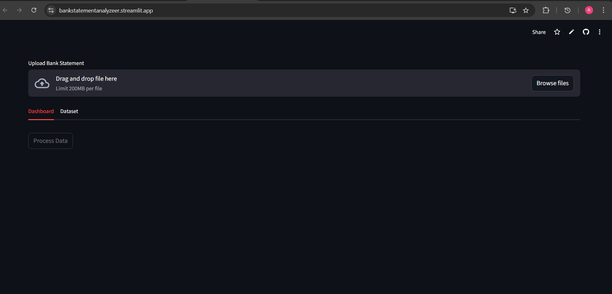
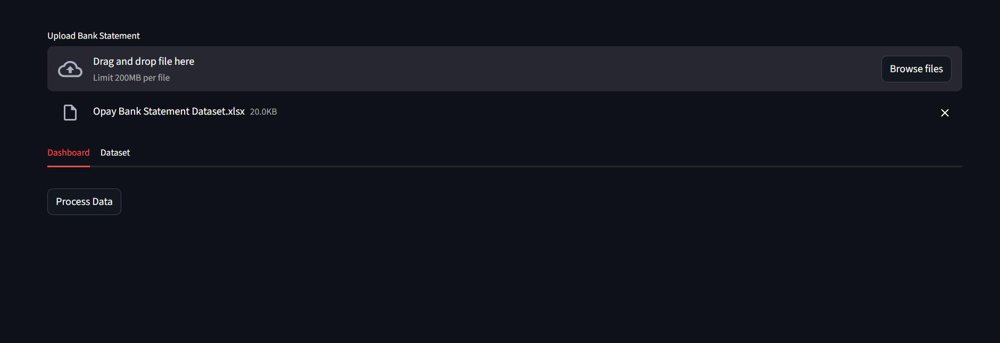
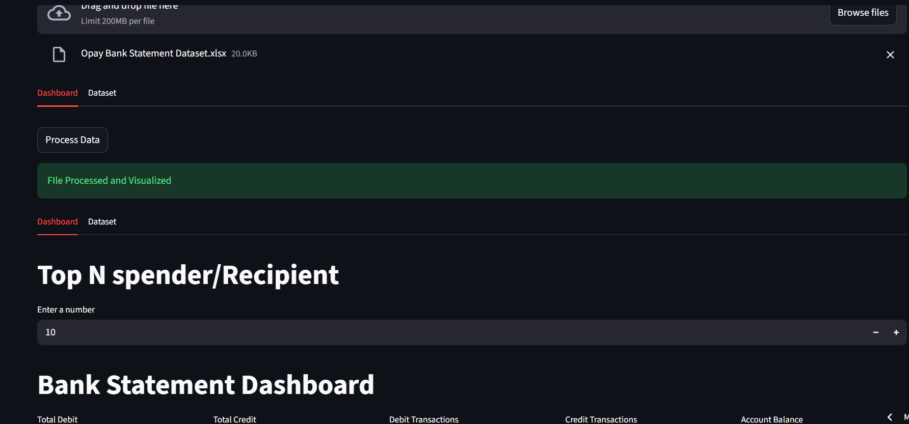

# OPay Statement Analyzer  
### Automated OPay Bank Statement Cleaning & Financial Dashboard

---

## Project Overview

**OPay Statement Analyzer** is a web-based analytics tool that automatically **cleans, processes, and analyzes OPay bank statements**, transforming raw financial data into a **clear and interactive dashboard within seconds**.

Bank statements often contain large volumes of transaction data that are difficult to analyze manually. This tool simplifies the process by allowing users to upload their statement and instantly receive **visual insights about their financial activity**.

The project demonstrates practical skills in:

- Data Cleaning
- Data Transformation
- Financial Data Analysis
- Dashboard Visualization
- Building Data Applications

---

## Live Application

You can try the application here:

<!-- Replace the link below with your deployed app link -->

🔗 **Live Demo:**  
[https://Bank Statement Analyzer.streamlit.app](https://bankstatementanalyzeer.streamlit.app/)

---

## Key Features

- **Automatic Data Cleaning**  
  Removes unnecessary formatting and prepares transaction data for analysis.

- **Fast Data Processing**  
  Converts raw OPay statements into structured datasets.

- **Interactive Financial Dashboard**  
  Displays insights through charts and summary metrics.

- **Transaction Analysis**
  - Spending patterns
  - Transaction distribution
  - Successful vs failed transactions
  - Transaction frequency

- **Instant Results**  
  Insights are generated within seconds after upload.

---

## How It Works

1. Download your **OPay bank statement**.
2. Upload the file to the application.
3. The system automatically:
   - Cleans the data
   - Processes transactions
   - Generates analytical insights
4. View the **financial dashboard instantly**.

---
---

## System Architecture

---

## Dataset Structure

Typical OPay bank statements include the following columns:

| Column | Description |
|------|-------------|
| Date | Transaction date |
| Transaction Type | Debit / Credit |
| Amount | Transaction value |
| Balance | Account balance after transaction |
| Description | Details of the transaction |

The application **standardizes and cleans these columns** before performing analysis.

---

## Data Processing Steps

### 1. Data Ingestion
Users upload their **OPay bank statement file**.

### 2. Data Cleaning
- Remove empty rows
- Standardize column names
- Convert dates into proper format
- Convert transaction amounts into numeric values
- Split Columns by Delimiter

### 3. Data Transformation
- Aggregate transaction totals
- Calculate summary metrics
- Identify patterns in transaction behavior

### 4. Data Visualization
Charts and insights are generated for the dashboard.

---

## Dashboard Insights

The dashboard presents several financial insights such as:

- Total number of transactions
- Total debit vs credit amounts
- Spending trends over time
- Top and Bottom Spenders and recepienets
- Most frequent transaction types

These insights allow users to **quickly understand their financial behavior**.

---

# Screenshots

<!-- 
Create a folder in your project called "screenshots"

Example structure:

project-folder
│
├── screenshots
│   ├── upload_page.png
│   ├── processing_page.png
│   ├── dashboard.png
│   └── insights_chart.png

Then reference them like below.
-->

---

## Upload Interface

<!-- Replace upload_page.png with your actual screenshot file -->

---

## Data Processing

---

## Financial Dashboard

---

# Technologies Used

| Technology | Purpose |
|-----------|--------|
| **Python** | Core programming language |
| **Pandas** | Data cleaning and transformation |
| **Streamlit** | Web application framework |
| **Visualization Libraries** | Charts and dashboard |

---
# Skills Demonstrated

This project demonstrates several core **data analytics skills**:

- Data Cleaning
- Data Transformation
- Exploratory Data Analysis
- Financial Data Analysis
- Data Visualization
- Dashboard Development
- Python Automation
- Pandas

---

# Future Improvements

Potential improvements include:

- Automatic **transaction categorization**
- Monthly **spending summaries**
- Budget tracking
- Exportable financial reports
- Support for statements from other banks

---

# Author

**Rabiu Hassan**

Aspiring Data Analyst passionate about transforming **raw data into meaningful insights**.

---

# License

This project is intended for **educational and portfolio purposes**.

